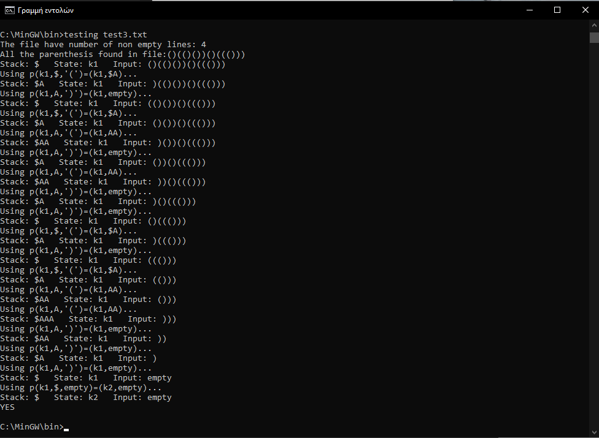

This is a C++ implemantation that check if parenthesis are balanced (given a file as argument) using determenistic stack automata.

There are 4 rules:

1. p(k1,$,”(“)=(k1,$a) 

2. p(k1,A,”(“)=(k1,AA)

3. p(k1,A,”)”)=(k1,ε)

4. p(k1,$,ε)=(k2,ε) 

The c++ program will answear with YES if the file is balanced and NO if not. If the final state is k1 then it's not balanced , if k2 then it is.

For each parenthesis input the program print the rule that is used , the stack elements , the current state and the remaining inputs.

